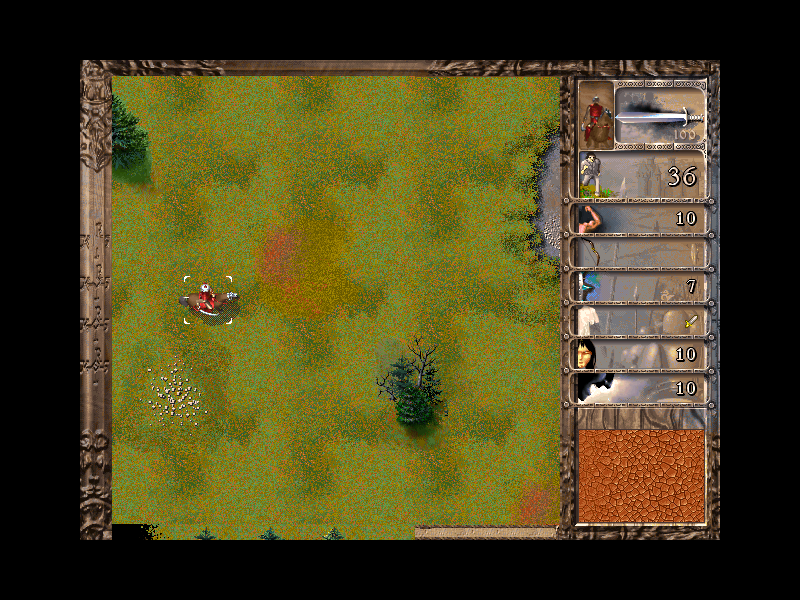
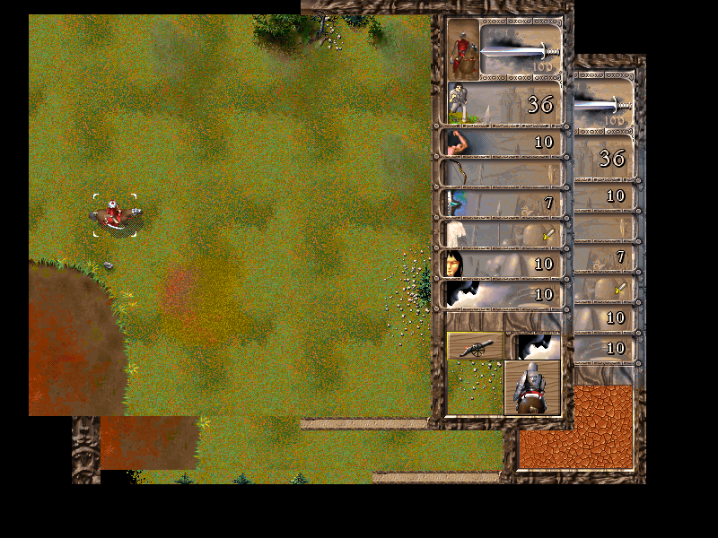
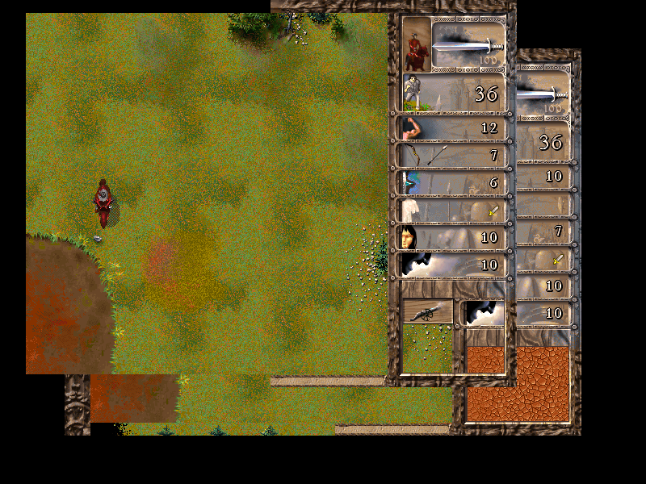
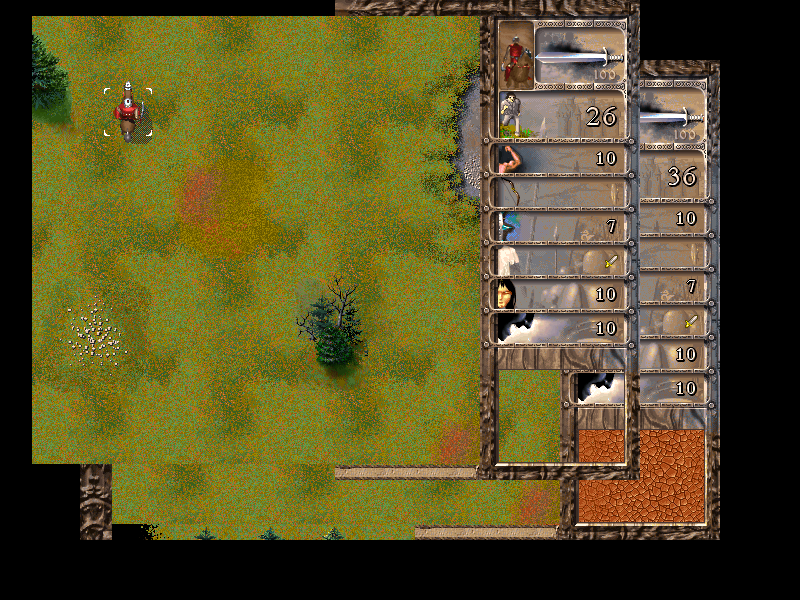
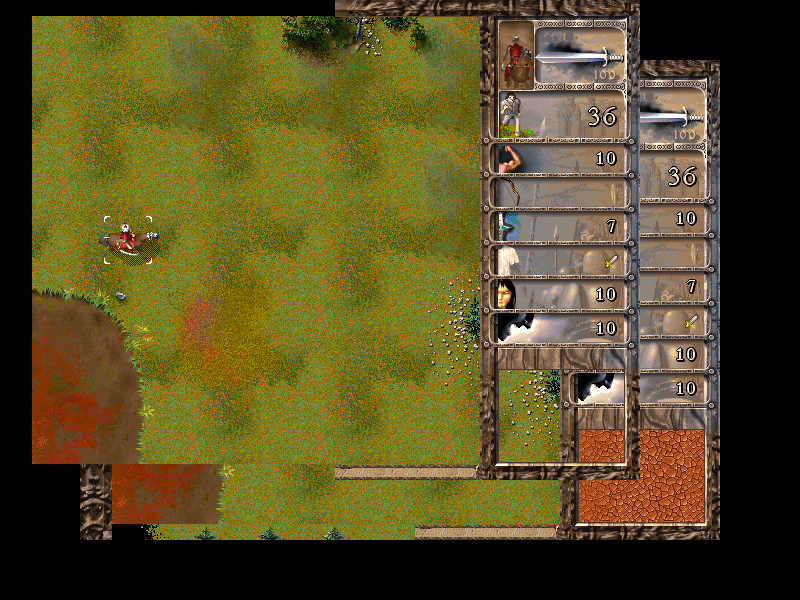

# Battle UI Evidence Matrix

- Overall: PASS
- Generated: `2026-05-20T10:50:38+02:00`
- Runtime policy: repo-only; does not launch Clash95, CDB, wrappers, PowerShell, or visible windows
- Stage: `gameplay-menu640-centered-map12-dynorigin-mapsurface-scrollclamp-presentbounds-minimapright-dynvswitch-castlecenter-all-battlecenter`
- Candidate SHA-256: `F3BC31F22EC15765D525ED3EADD00183C78BB1B8F76B3B1C3978AF3480A546EF`
- Promotion status: `validation_stage_only`
- Stable stage should change: `False`

## Checks

- force_entry: PASS
- command_hit: PASS
- command_callback: PASS
- enabled_callback: PASS
- grid_hit: PASS
- modal_classified: PASS
- patch_stage: PASS
- stable_smoke: PASS

## Key Evidence

- centered_visual: `centered-native-640x480`
- command_hit_ok: `True`
- command_native_hit_ok: `True`
- command_callback_branch: `precondition-disabled`
- enabled_callback_branch: `state2`
- grid_visual_cell: `[1, 1]`
- grid_native_cell: `[0, 0]`
- modal_classified: `True`

## Failures

- None

## Screenshots

